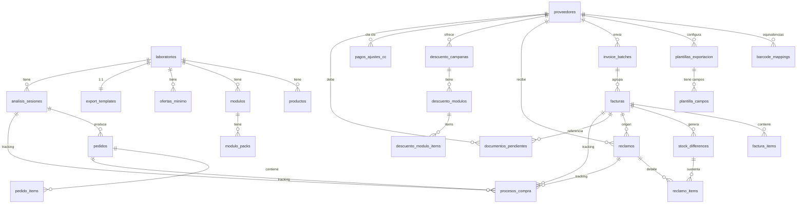

# Esquema de DB — Farmacia

> Generado desde `database.py`. Mantener sincronizado cuando se agreguen modelos / FKs.

## Diagrama (Mermaid ER)

## Tablas por dominio

### Master / config
| Tabla | PK | FK | Rol |
|---|---|---|---|
| `configuracion` | id | — | singleton (umbrales, rotación, nombre farmacia) |
| `laboratorios` | id | — | catálogo de labs |
| `productos` | id | laboratorio_id | master de EANs (+ alts 1/2/3) |
| `product_analytics` | codigo_barra | — | métricas (ventas, rotación, forecast) |
| `erp_stock` | id | — | snapshot ERP (se reemplaza en cada carga) |

### Proveedores y equivalencias
| Tabla | PK | FK | Rol |
|---|---|---|---|
| `proveedores` | id | — | drog./lab./otro, match_strategy |
| `barcode_mappings` | id | proveedor_id | EAN factura → EAN ERP |
| `plantillas_exportacion` | id | proveedor_id | formato ancho fijo (export pedido) |
| `plantilla_campos` | id | plantilla_id | campos de la plantilla |

### Facturas / reclamos
| Tabla | PK | FK | Rol |
|---|---|---|---|
| `invoice_batches` | id | proveedor_id | lote de carga |
| `facturas` | id | batch_id | FAC/NCR |
| `factura_items` | id | factura_id | renglones |
| `stock_differences` | id | factura_id | diferencias factura vs ERP |
| `reclamos` | id | proveedor_id, factura_id | reclamo generado |
| `reclamo_items` | id | reclamo_id, diferencia_id | detalle reclamo |

### Descuentos (campañas)
| Tabla | PK | FK | Rol |
|---|---|---|---|
| `descuento_campanas` | id | proveedor_id | campaña |
| `descuento_modulos` | id | campana_id | módulo dentro de campaña |
| `descuento_modulo_items` | id | modulo_id | ítems con % dto |

### Módulos de packs (análisis pedido)
| Tabla | PK | FK | Rol |
|---|---|---|---|
| `modulos` | id | laboratorio_id | lista guardada |
| `modulo_packs` | id | modulo_id | EAN pack ↔ EAN unidad + cant. |

### Pedidos y proceso
| Tabla | PK | FK | Rol |
|---|---|---|---|
| `analisis_sesiones` | id | laboratorio_id | sesión de análisis |
| `pedidos` | id | analisis_sesion_id | pedido guardado |
| `pedido_items` | id | pedido_id | renglones sugeridos |
| `procesos_compra` | id | pedido_id, factura_id, reclamo_id, analisis_sesion_id | tracking end-to-end |

### Lab — export y ofertas c/mín
| Tabla | PK | FK | Rol |
|---|---|---|---|
| `export_templates` | laboratorio_id | laboratorio_id | columnas + header por lab |
| `ofertas_minimo` | id | laboratorio_id | Bernabó (grupo_id, unidades_min) |

### Cuenta corriente / documentos
| Tabla | PK | FK | Rol |
|---|---|---|---|
| `pagos_ajustes_cc` | id | proveedor_id | movimientos CC |
| `documentos_pendientes` | id | proveedor_id, factura_id | NCR/remitos pendientes |

## Ejes de relación principales

- **Proveedor** es el hub de `barcode_mappings`, `facturas` (vía batch), `reclamos`, `descuento_campanas`, `pagos_ajustes_cc`, `plantillas_exportacion`.
- **Laboratorio** es el hub de `productos`, `modulos`, `ofertas_minimo`, `export_templates`, `analisis_sesiones`.
- **Factura** conecta compras con reclamos vía `stock_differences` → `reclamo_items`.
- **`procesos_compra`** es la tabla de tracking transversal: liga sesión de análisis → pedido → factura recibida → reclamo.
